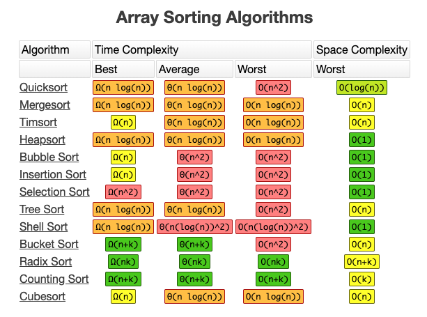

# Sorting Algorithms

## Description
- Sorting is when you have an unordered list and you want to put the items in order. Classic computing problem. 
- Sorting is the process of rearranging items in a collection (e.g. an array) so that the items are in some kind of order

**Problem:**  Unordered list of items and you want to put them in order.  

## Examples
- Sorting #s from smallest to largest
- Sorting names alphabetically
- Sorting movies based on release year

## Challenges 
- There are MANY algorithms that sort - some better than others. 

## 5 sorting algorithms & their time complexities

Iterative Algos - repeat an action to solve, no recursion, for or while loops

1. Insertion Sort - O(N^2)
2. Selection Sort- O(N^2)
3. Bubble Sort- O(N^2)

Recursive
4. Merge Sort - O(N log N)
5. Quicksort - O(N^2)

- **Bubble sort** - walk through entire array, look at 1 item and next item, if out of order swap them. Then loop back to the beginning and keep going until no more swaps

- **Selection sort**- similar to insertion, you have sorted on left and unsorted on right.  You look through all unsortd items, find the smallest item, take that and put it at the end of your sorted array. Look through remaining, find smallest item, put that in sorted array, and repeat.

## Why is sorting important? 
- It allows us to search. 
- Sorting not as important as searching, which is what we need to do all of the time. The def hasAnimal is very common - we have collection and we need to find something in. An example - we have a database and need to find all of the users or a user with user id 10 - retrieve record and send back.  These are all searches and **search is O(n).** Let's take Facebook with billions of users - O(n) means a billion operations to find an item. That takes a V long time to do a single retrieval. **We need to find a better way to search and that better way involves sorting**
- **If we have an unsorted array, what can we do to modify this search?** We can reduce the size of potential results using an algorithm called **binary search.**