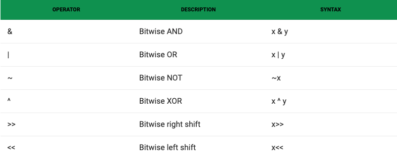

# 1) What are the components of a computer? processor (cpu, alu), memory, registers, bus

## Computer Components
- CPU: The brain that executes instructions in RAM (memory) and talks to the keyboard 
    - CPU Words: Bytes of data are stored in RAM. Larger 64-bit numbers, store sequentially in RAM, that the CPU can operate on at once are called words. 
- RAM (Random Access Memory): Can randomly access data here in memory
    - A big array of bytes that can be retrieved by index, just like a regular array
    - Index is a _address_ or _pointer_
    - Each element in RAM can store 1 byte per address
    - 1 byte = 8 bit number 
    - Values in RAM are written in hexadecimal because hexadecimal bytes are 2 digits long 
- ALU (Arithmetic Logic Unit): Does math + comparisons
- Interrupt Handler: The job of the interrupt handler is to do whatever needs doing with the data that’s arrived from the peripheral. Sometimes it’s adding a keystroke to a buffer. Sometimes it’s telling the operating system that a block of data from the disk is ready to hand over to a program. 

## THE CPU 
CPU, Clock(s), Program Counter, Instruction Register, Arithmetic Logic Unit, bus(es), RAM, Registers, Operations.

CPU consists of a few things
1. Transistors (like an on/off switches)- basic element of computations that controls flow of electricity. Used to buid logic gates.
2. Logic Gates made of transitors & are combined to create far more complex structures
    - ALU
    - CPUs
3. Digital Logic Common Operators- performed by gates. A collection of transistors put together to perform one of the basic boolean logic functions on a single bit or a collection of bits. 
    - AND, OR, NOT
    - XOR, NOR, NAND
4. Memory/System Bus: How the CPU communicates with RAM, how datsa is passed from CPU to RAM.
    - Size or width is typically the number of **bits** a computer is advertising having. i.e. 64-bit CPU has a 64-bit wide data  bus and address bus. 
5. **CPU instruction**: A byte or sequence of bytes in RAM that the computer knows how to interpret and perform actions based on.
- There are instructions to do math, like `ADD` and `SUB`, instructions for comparing values like `CMP`, instructions for jumping to other parts of memory like `JMP`, and many more.
6. CPU clock: When they say your CPU is 3.2 GHz, this is what they are referring to. It’s the number of times per second the CPU does some processing.
7. CPU word: the natural size of a piece of data with which the CPU can interact. Usually written down in the bit “size” of the CPU, i.e. “This is a 64-bit CPU.”
8. CPU Registers: Special storage locations built-in that store words that can be accessed at ultra high-speed(R0, R1). Similar to RAM except stored directly on the CPU for speed. 

# 2) Number Bases & Conversions between binary, decimal, and hex.
## Number Bases
- The number _base_ refers to how many individual _digits_ that number system has
- **Decimal** has 10 digits (0, 1, 2, 3, 4,5 ,6, 7, 8, 9) and so it is ***base 10***
    - In decimal, we have 10 digits, 0-9. Multi-digit numbers have the 1’s place, the 10’s place, and the 100’s place, etc.
    - Examples: 
        - 10 has 1 in the 10ths place, 0 in the 1's place
        - 123 has 1 in the 100's place, 2 in the 10's place, 3 in the 1's place
- **Binary** has 2 digits (0, 1) so it is ***base 2***. A **binary digit** is called a  **bit** for short.
    - In binary, we only have two digits, 0-1. Multi-digit numbers have the 1’s place, the 2’s place, the 4’s place, the 8’s place, the 16’s place, etc.
    - Once we run out of digits, we add a 2s place - 10 is one 2 and zero 1s
- **Hexadecimal/Hex** has 16 digits (0, 1, 2, 3, 4,5 ,6, 7, 8, 9, A, B, C, D, E, F) so it is ***base 16***
- **Octal** has 8 digits (0, 1, 2, 3, 4, 5, 6, 7)

## Terminology 
- **Bit**: a 0 or 1 - this is base 2 or binary
- **Nibble**: 4 bits. Max value: 15 decimal,  F hex. Min value 0.
- **Byte**: 8 bits 
- **Octet**: synonym for byte

### Binary Powers of 2
```python
2 ** 0 = 1
2 ** 1 = 2
2 ** 2 = 4
2 ** 3 = 8
2 ** 4 = 16
2 ** 5 = 32 —> just remember this
2 ** 6 = 64
2 ** 7 = 128
2 ** 8 = 256
2 ** 9 = 512
2 ** 10 = 1024 —> remember this too log n - binary search tree of 1024 items and only 10 comparisons
```

## Bytes 
- Bytes are data stored in RAM (memory)
- Each element in RAM can store one byte per address
1 byte = 8 bits 
4 bytes = 32 bits
8 bytes = 64 bits 

## Hex= Base 16
- RAM values are written in hexadecimal 
- Hex is a base-16 numbering system. It has 6 more digits than decimal (which is base 10). These 6 digits, which come after 9, are A, B, C, D, E, and F.
- Counting to decimal 16 in hexadecimal: 0 1 2 3 4 5 6 7 8 9 A B C D E F 10
- You might have already seen hexadecimal numbers in CSS colors, such as #ccff00.
- Useful for representing large binary numbers in a way that's a bit easier to read

```javascript
// All of these represent the number of apples on the table:

let numA = 12;     // decimal
let numB = 0xC;    // hexadecimal, leading 0x
let numC = 0b1100; // binary, leading 0b

numA === numB === numC; // TRUE!
```

## Convert Binary to Decimal
### Example 1: 
``` python
+----------128's place
|+---------64's place
||+--------32's place
|||+-------16's place
||||+------ 8's place
|||||+----- 4's place
||||||+---- 2's place
|||||||+--- 1's place
||||||||
01010110
- 1 of 64
- 1 of 16
- 1 of 4
- 1 of 2
- 64 + 16 + 4 + 2 = 86 in decimal
- 1010110 in binary == 86 in decimal 
``` 

### Example 2:
``` python
+------ 8's place
|+----- 4's place
||+---- 2's place
|||+--- 1's place
||||
1010
- 1 of 8
- 1 of 2
- 8 + 2 = 10 in decimal
- 1010 binary == 10 decimal.
```

## Convert Decimal to Binary
- Ask yourself: out of 128s, 64s, 32s, 16s, 8s, 4s, 2s, 1s - what adds up to the decimal? 
- Start with the highest power of two that’s lower than the number

### Example 1: 123 decimal 
- We know we have zero 128s in the number, because it’s only 123. But there must be a 64 in there.
- 1 of 64 (leaves us 59)
- 1 of 32 (leaves us 27)
- 1 of 16 (leaves us 11)
- 1 of 8 (leaves us 3)
- 1 of 2
- 1 of 1


``` python
+---------64's place
|+--------32's place
||+-------16's place
|||+------ 8's place
||||+----- 4's place
|||||+---- 2's place
||||||+--- 1's place
|||||||
1111011 = 123 decimal 
```

### Example 1: 67 decimal
- 1 of 64
- 1 of 2
- 1 of 1
``` python
+---------64's place
|+--------32's place
||+-------16's place
|||+------ 8's place
||||+----- 4's place
|||||+---- 2's place
||||||+--- 1's place
|||||||
1000011 = 67 decimal 
```

### Example 2: 33 decimal
- 1 of 32
- 1 of 1

``` python
+--------32's place
|+-------16's place
||+------ 8's place
|||+----- 4's place
||||+---- 2's place
|||||+--- 1's place
||||||
100001 = 33 decimal
```

``` javascript
// Decimal constants (just like normal)
const val = 123;
// Converting a decimal to a binary string
const binVal = val.toString(2); // convert to base 2 number string
console.log(`${val} decimal is ${binVal} in binary`);
```
- Note the result is a string bc you had the number in val as a Number; the only other way to represent is a string. 

```python
0b00110101  - adding 0b prefix will convert binary to decimal
```

## Convert Binary to Hexadecimal (base 16)
- Since 16 and 2 are powers of two, there are an even number of binary bits per hex digit: 4 bits per hex digit.
- If we have a 1-byte number, like 10100011, we split it in segments of 4 bits (nibbles) and convert each of those to a hex digit. It might be more convenient to convert do decimal first for numbers over 9 decimal.
- Counting to decimal 16 in hexadecimal: 0 1 2 3 4 5 6 7 8 9 A B C D E F 10

```python
10100011       - each can be converted into a hexadigit 
1010      0011


+------ 8's place
||+----- 4's place
|||+---- 2's place
||||+--- 1's place
||||
1010 = 8 + 2 = 10 decimal --> A hexadecimal
0011 = 1 + 2 = 3             +3
                            ------
                            A3 hexadecimal ==  10100011 binary
```

## Convert Hexadecimal to Binary (base 2)
- Take each digit individually and convert it to decimal
- Then convert each decimal to binary
```python
C7         - each digit can be converted into a bit
C          7
12 dec     7 
8 + 4     4 + 2 + 1 
+------ 8's place
||+----- 4's place
|||+---- 2's place
||||+--- 1's place
||||
1100 binary == C in hex
0111 binary == 7 in hex   ---> C7 hex = 11000111 in binary 
```

# 3) Bitwise Operators
- Bitwise operators are operations that can be applied to bits at a low level  - they are used to compare _integers_ in their _binary_ formats
- When performing a binary operations between 2 integers, there are first converted into binary numbers.


## Truth Tables
- Boolean operations are often demonstrated with **truth tables**
- A **truth table** shows for a variety of inut, what the output of certain boolean operations or gates will be 


## Bitwise Operators
- AND
- OR 
- NOT
- XOR: Exclusive OR, it's result is true if only ONE inpurt is true
- NAND: Not and, The invert of AND and NOT AND i.e. not (A and B)
- Right shift
- Left shift 



## Truth Table for Bitwise Operators
|  A    |  B    | A AND B   | A OR B    | A XOR B   | A NOR B   | A NAND B |   
|-----  |-----  |---------  |---------  |---------  |---------  |----------|
|  0    |  0    |    0      |   0       |    0      |   1       |    1     |
|  0    |  1    |    0      |   1       |    1      |   0       |    1     |
|  1    |  0    |    0      |   1       |    1      |   0       |    1     |
|  1    |  1    |    1      |   1       |    0      |   0       |    0     |

## How to solve Bitwise Operations
1. Take your decimals and write them in binary
2. Stack them on top of eachother, lining up binary digits
3. Take each column, and DIGIT of your two binary numbers and compare them to each other
- This requires you to think about things in binary and requires bit by bit

When you are performing a boolean operation on a multi-bit number, each pair of bits is considered in isolation. In the following example, we perform a bitwise-AND on two bytes. We consider the top bit and bottom bit of each position to determine the result:

### Example 1- AND: 4 & 3 = 0

4 - 0100
3 - 0011 

    0100
  & 0111
-----------
    0000

### Example 2- OR: 14 | 6 = 14
14 - 1110
6 - 0110 

    1110
  | 0110
-------------
    1110 = 14

### Example 3- BITSHIFT Right: 01011000 >> 4
01011000 >> 4  
00101100 
00010110
00001011
00000101
88 >> 4 = 5

**WHY Bitshift?** Leading 2 bits gives us some info. Tells Tells us which 2 arguments operations have

**What arithmetic operation is shifting to the left by 1 equal to?**
- Multiplying by 2 
8<<1 = 16 
- Shifting to right by 1 is the same as dividing by 2
8>>1 =4
- Comes down to how binary works. Moving everything over by 1 place menas every single column gets divided by 2. 

**Logical/Boolean vs Bitwise Operators**
- Boolean operators are usually used on boolean values but bitwise operators are usually used on integer values.
- Boolean operators are short-circuiting but bitwise operators are not short-circuiting.


# 5) CPU Stack 
Most CPUs have a **built-in stack** that’s useful for:
- **Storing temporary data** (if you need to free registers for other users)
- Making subroutine calls
- Handling interrupts 

### A Stack Consists of
- An array for storing values (chunk of RAM)
- Stack pointer which points to the top element of the stack (SP)
- PUSH and POP instructions

### Push and Pop
**To `PUSH` a value in a register onto the stack:**
- Decrement `SP`.
- Store the value in the register into RAM at the address stored in `SP`.

**To `POP` a value from the stack into a register:**
- Retrieve the value from RAM at the address stored in `SP`, and store that value in the register.
- Increment `SP`.
What happens if we pop on an empty stack? If we look at vector table, 4 is our Key pressed memory slot. What happens if we pop in 1? What happens? **STACK UNDERFLOW** 


# 6) Interrupt 
An **interrupt** is a mechanism which occurs when:
- The CPU is busy processing instructions
- A peripheral device (keyboard, mouse, etc) gets some work done
- The peripheral has completed a task and gets the CPU's attention through an **interrupt** whichnotifies the CPI that work is complete
- If there's an interrupt, the CPU saves all of it's work (pushes register and flags and program counter and anything else onto the stack) then begines executing the **interupt handler code** which is located somewhere else in memory
- Once the interrupt handler is complete, we say the interrupt has been **services** 
- Then all registers and flags are popped of the stack and the CPU resumex execution of where it left of, as if nothing happend

know what an interrupt is

know how the ls-8 works, be able to implement operations

# 7) Subroutines 

- When the CPU is in the middle of executing instructions, sometimes a peripheral (keyboard, mouse, etc) will complete a previously-assigned task and needs some software to handle the results of that task
- The peripheral will get the CPU's attention via INTERUPTS- it raises a voltage on a wire that ultimately ends up in the CPU


Being a generally simple device, the CPU doesn’t have the concept of function names, arguments, or return values. 
All it knows is that it can call a subroutine (i.e. push the address of the next instruction onto the stack, move the PC to the address of the subroutine) and it can return from that subroutine (i.e. pop the value from the top of the stack into the PC.)


\\Why is the stack used to store the return address? Why not just a single register or memory location?
\\\store return addresses
pass args to subroutines